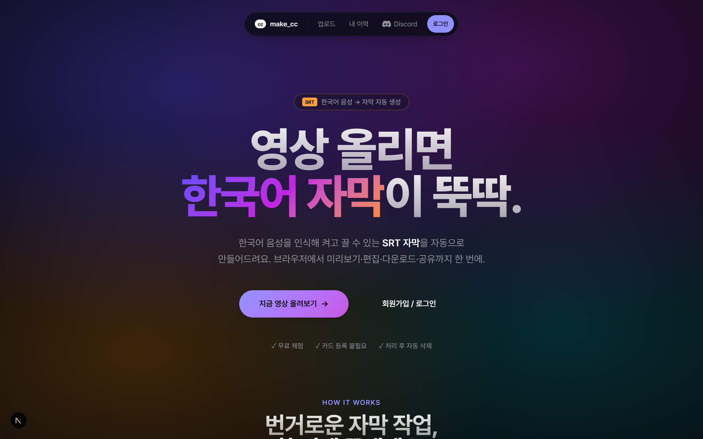
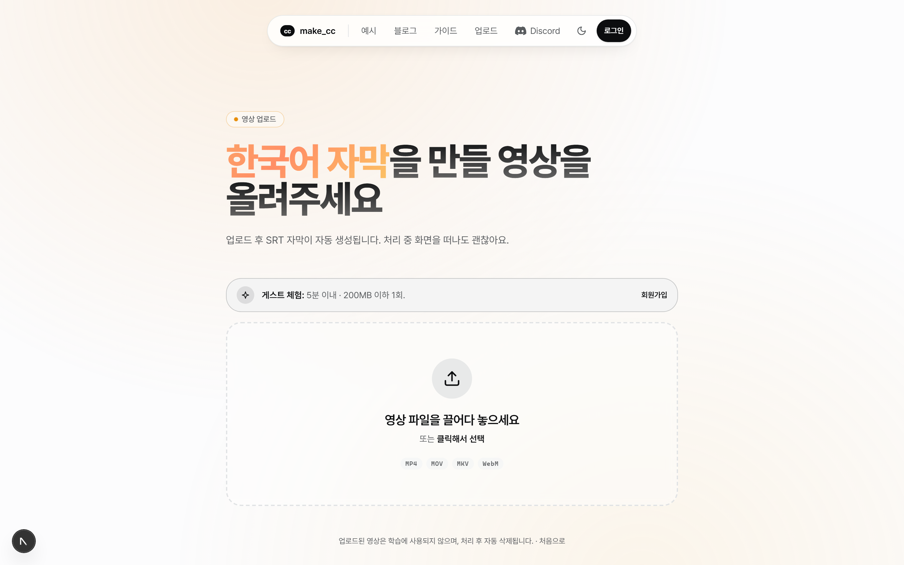
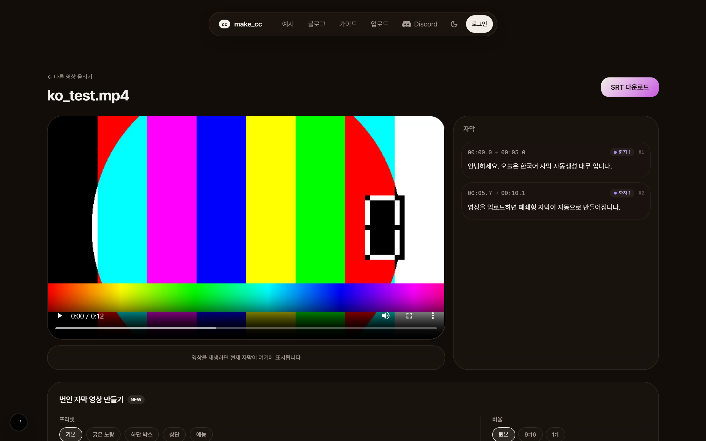
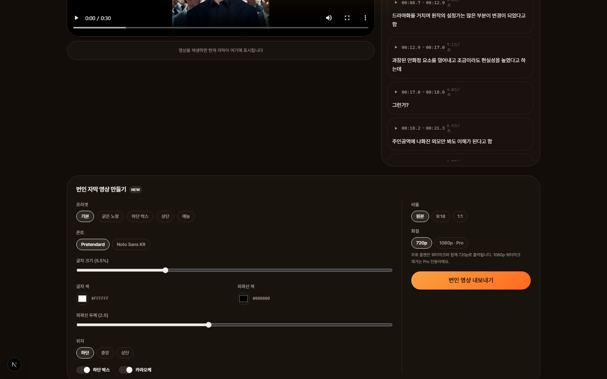
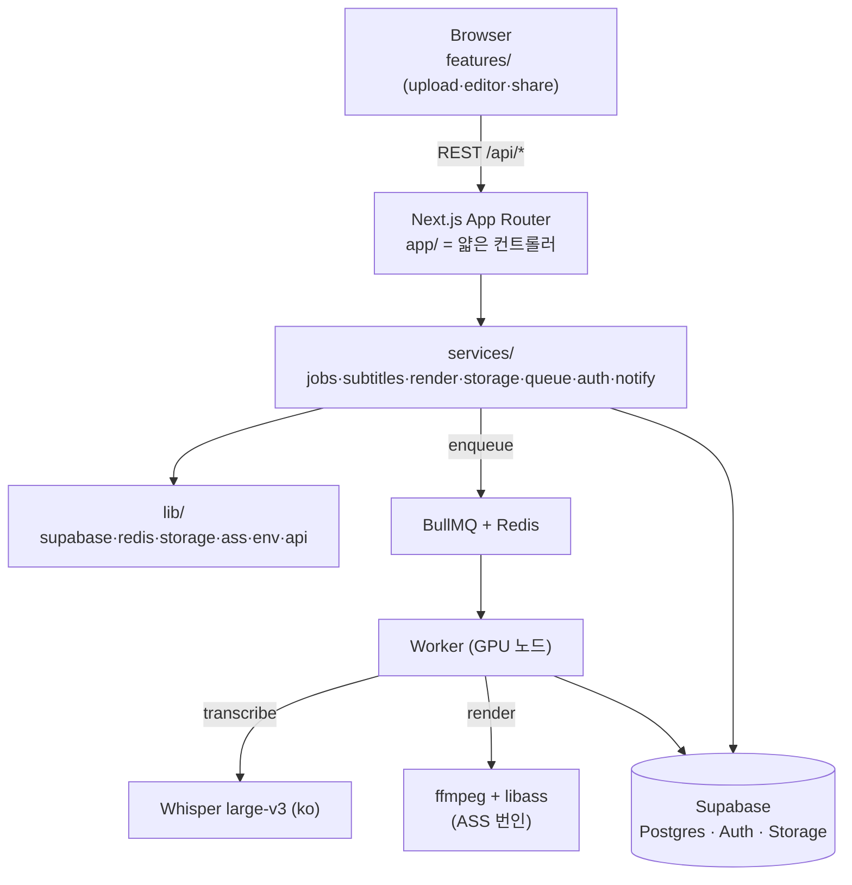

# make_cc — 한국어 영상 자막 자동 생성 + 번인 자막 스튜디오

> 한국어 영상을 올리면 self-hosted Whisper로 **자막(SRT)** 을 자동 생성하고,
> 브라우저에서 미리보기·편집·공유하고, **스타일을 입혀 영상에 박는 번인(burn-in) 자막 영상**까지 만드는 풀스택 웹 서비스.

<p align="center">
  <strong>🔗 라이브 데모 · <a href="https://makecc.vercel.app">makecc.vercel.app</a></strong>
</p>

<p align="center">
  
  
  
  
  
  
  
</p>

---

## 📸 스크린샷

> 이미지는 `docs/screenshots/`에 있습니다. (캡처 가이드: [`docs/screenshots/README.md`](docs/screenshots/README.md))

| 랜딩 | 업로드 |
|------|--------|
|  |  |

| 자막 편집기 | 번인 자막 스튜디오 |
|-------------|--------------------|
|  |  |

---

## ✨ 핵심 기능

- **자막 자동 생성** — 영상 업로드 → self-hosted Whisper(large-v3, ko)로 STT → 표준 **SRT** 산출
- **브라우저 편집기** — `<video>` 동기화 + cue 단위 텍스트 편집 + 5초 디바운스 자동 저장
- **번인 자막 스튜디오** ⭐ — 프리셋 5종 + 폰트·색·외곽선·위치·박스·카라오케 커스텀 → **스타일이 박힌 MP4** 내보내기 (원본 / 9:16 / 1:1)
- **무료/Pro 게이팅** — 무료는 워터마크 + 720p, Pro는 워터마크 제거 + 1080p (서버·워커 강제)
- **공유** — 회원이 공유 토큰 생성 → 익명 다운로드 (`/s/[token]`)
- **게스트 지원** — 비로그인도 HTTP-only 쿠키로 잡 생성 (일일 캡)
- **알림** — 잡 완료 시 이메일(Resend) / Discord DM. **Discord 계정 연동**으로 알림 채널 선택(email/discord/both)
- **자동 청소** — 만료된 영상·렌더 출력 스토리지 자동 삭제 (게스트 영상은 번인용 1시간 보존)
- **콘텐츠/법적 페이지** — 사용법 가이드(`/guide`) · FAQ(`/faq`) · 개인정보처리방침(`/privacy`)

---

## 🏗️ 아키텍처

**Option C (Pragmatic Modular)** — UI(`features/`) · 도메인(`services/`) · 인프라(`lib/`)를 분리하되,
STT와 번인 렌더는 **하나의 큐·워커 프로세스**를 공유해 배포를 단순하게 유지.



### 설계 하이라이트 (엔지니어링 포인트)

- **얇은 컨트롤러 / 두꺼운 서비스** — API Route는 검증·인증·응답만, 비즈니스 로직은 전부 `services/`. **ESLint로 레이어 임포트 경계 강제**.
- **잡 상태 머신** — `pending → uploading → queued → transcribing → finished|failed|cancelled` 전이를 단일 모듈에서만 수행 + append-only `job_events` 기록.
- **게이팅 단일 지점** — 워터마크·해상도는 클라이언트를 신뢰하지 않고 `services/render`에서 `is_pro` 기준으로 **재결정** → DB에 게이팅된 값 저장 → 워커가 그대로 렌더. (수익 누수 방지)
- **Pure 렌더 로직** — ASS 자막 빌드는 입력→출력 결정적 pure 함수(`lib/ass`)로 분리 → 색 변환·정렬·카라오케·이스케이프를 단위테스트로 고정.
- **Graceful degrade 큐** — Redis 미연결 시에도 enqueue가 throw하지 않고, DB 폴링 워커(`worker:poll`)가 잡을 대신 픽업.
- **이중 권한 검증** — Supabase RLS + 앱 레이어 소유 검증. service_role 키는 워커·시스템 작업에서만.

---

## 🧰 기술 스택

| 영역 | 선택 |
|------|------|
| 프레임워크 | Next.js 15 (App Router) · TypeScript strict |
| 인증 | Supabase Auth (매직 링크 + OAuth) |
| DB | Supabase Postgres (RLS) |
| 스토리지 | Supabase Storage (private 버킷 + signed URL) |
| 큐 | BullMQ + Redis |
| STT | self-host Whisper large-v3 (ko) — 별도 GPU 워커 |
| 번인 | ffmpeg + libass (ASS 필터) |
| UI | Tailwind v4 · shadcn/ui · Zustand · TanStack Query |
| 알림 | Resend (이메일) · Discord (봇 DM + 계정 연동) |
| 테스트 | Vitest (단위·통합) |
| 배포 | Vercel (앱) + GPU 노드 (워커) |

---

## 📁 프로젝트 구조

```
src/
  app/          Next.js App Router (route handlers, pages) — 얇은 컨트롤러
  features/     UI 모듈 (upload · editor · history · share · account)
  services/     도메인 로직 (jobs · subtitles · render · storage · queue · notify · auth)
  lib/          인프라 클라이언트 (supabase · redis · storage · ass · env · api · logger)
  components/ui shadcn/ui 원자 컴포넌트
  types/        도메인 타입 (Job · Cue · Render · CaptionStyle ...)
worker/         GPU 노드에서 실행되는 별도 패키지 (services/ 재사용)
supabase/       SQL 마이그레이션
tests/          vitest 단위·통합
docs/           PDCA 설계 문서 (plan · design · qa)
```

---

## 🚀 로컬 실행

```bash
# 1. 의존성
npm install

# 2. Redis (BullMQ용) — Docker 또는 Upstash
docker compose up -d

# 3. 환경변수
cp .env.example .env        # Supabase URL/anon/service_role 등 채우기

# 4. Supabase: SQL Editor에 supabase/migrations/*.sql 순차 실행

# 5. 개발 서버
npm run dev                 # → http://localhost:3000

# 6. 워커 (STT/렌더) — GPU 노드 또는 로컬
npm run worker              # Redis 기반
npm run worker:poll         # Redis 없이 DB 폴링
```

> Whisper STT와 ffmpeg 번인은 별도 GPU 워커에서 동작합니다. 번인 카라오케는 Whisper `word_timestamps`로 추출한 단어 타이밍(`{jobId}.words.json`)이 있을 때 활성화되며, 없으면 평문으로 렌더됩니다.

---

## ✅ 테스트

```bash
npm test         # Vitest (162 tests)
npm run typecheck
npm run lint
```

Supabase·Redis는 단위 테스트에서 mock 처리하고, 핵심 도메인 로직(상태 머신, 게이팅, ASS 빌더, SRT 파싱, 알림 라우팅)을 결정적으로 검증합니다.

---

## 🗺️ 로드맵

- [x] SRT 자동 생성 + 편집기 + 공유 (video-auto-caption)
- [x] 번인 자막 스튜디오 + 무료/Pro 게이팅 (burnin-captions)
- [x] Whisper 단어 타이밍 통합 → 번인 카라오케 (v0.3.0)
- [ ] 화자 분리(speaker diarization)
- [ ] 번역 자막 · 다국어 (Phase 2)

---

## 📋 변경 이력

날짜별·버전별 작업 기록은 **[CHANGELOG.md](CHANGELOG.md)** 참고. 버전은
[GitHub Releases](https://github.com/adll1151/make_cc/releases)에서도 볼 수 있습니다.

| 버전 | 날짜 | 핵심 |
|------|------|------|
| **0.3.0** | 2026-06-20 | 프로덕션 준비 — 폰트·AdSense 정책·가이드/FAQ·카라오케·줄바꿈·Redis 크래시 수정·실서비스 처리 검증 |
| **0.2.0** | 2026-06-17 | Google AdSense + 개인정보처리방침 |
| **0.1.0** | 2026-06-17 | 초기 릴리스 — 자막 자동 생성 + 편집기 + 번인 스튜디오 |

---

## 📄 라이선스

[MIT](LICENSE)
